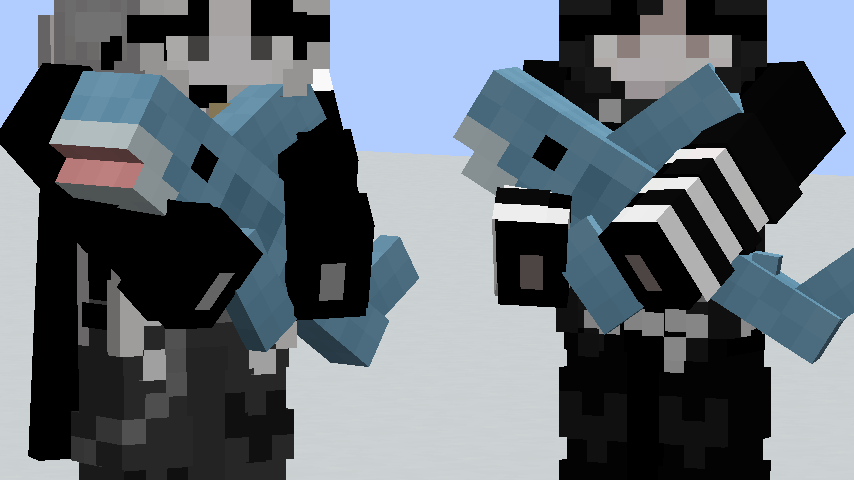
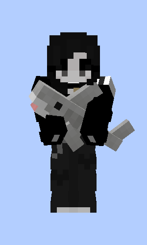
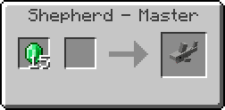
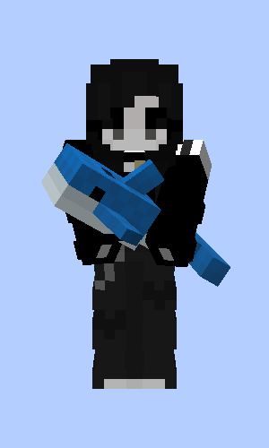
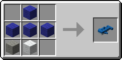

# Blåhaj

A Minecraft mod that adds the IKEA BLÅHAJ Soft toy shark and a giant bread pillow as items.

| Item | Preview | Recipe |
|---|---|---|
| Soft Toy Shark |  |  |
| Gray Toy Shark |  |  |
| Soft Toy Blue Whale |  |  |
| Bread Pillow |  |  |

## Building

Building? 🙂

Blåhaj Mod doesn't have a very well structured build system — in fact, each mod platform should have its own `build.gradle`, and is its own subproject. If you want detailed instructions...

	cd platform-${loader}-${version}
	./gradlew build

If you'd like a one-liner that builds everything, then `for platform in $(ls -d platform-*); do pushd "$platform"; ./gradlew build; popd; done` on the root of the project (POSIX sh only or compatible).

Inspired by [Unascribed's Ears](https://git.sleeping.town/unascribed/Ears).

## License

This mod is licensed under the [Unlicense](./LICENSE). Feel free to learn from it and incorporate it in your own projects.

The icon of this project is the Blobhaj by Heatherhorns, and is licensed under a [Creative Commons Attribution 4.0 International License](http://creativecommons.org/licenses/by/4.0/).
